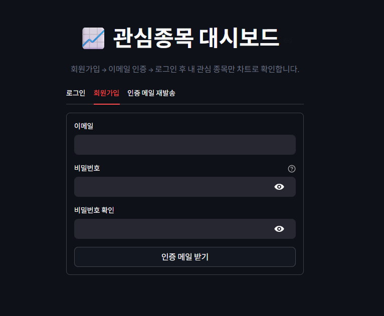
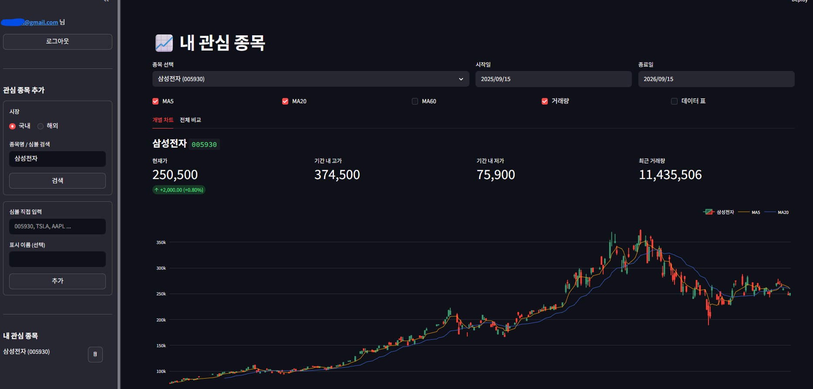

<p align="center">
  
</p>

<p align="center">
  
  
  
  
</p>

---

## 1. 프로젝트 내용

**로그인한 회원이 자기가 등록한 관심 종목만 차트로 보는 Streamlit 앱입니다.**

기존 `streamlit_stock.py` 는 종목 목록이 코드에 하드코딩되어 있어 누가 접속하든 같은 화면을 봤습니다.
이 프로젝트는 여기에 **회원 인증**과 **개인별 관심 종목**을 붙여, 사용자마다 다른 대시보드를 보게 만든 것입니다.

### 주요 기능

| 기능 | 설명 |
| --- | --- |
| 🔐 회원가입 | 이메일 + 비밀번호. 비밀번호는 **bcrypt 해시**로만 저장 |
| ✉️ 이메일 인증 | **Gmail 앱 비밀번호**로 인증 URL 발송 → 링크를 열어야 가입 확정 |
| ⭐ 관심 종목 | 국내 2,871종목 / 해외 7,074종목 검색 후 개인 목록에 추가·삭제 |
| 📈 개별 차트 | 캔들스틱 + 이동평균선(MA5/20/60) + 거래량 |
| 📊 전체 비교 | 관심 종목 전체를 첫날=100 기준 상대 수익률로 비교 |

### 동작 흐름

```
회원가입 → 인증 메일 수신 → 링크 클릭(?verify=토큰) → 가입 확정 → 로그인 → 관심 종목 등록 → 차트
                                     ↑
                            인증 전에는 로그인 차단
```

### 화면



---

## 2. 설치 방법

### 요구 사항

- Python 3.10 이상 (개발·검증 환경: **3.13.9**)
- Gmail 계정 (2단계 인증 활성화 — 앱 비밀번호 발급에 필요)

### 설치

```bash
git clone <저장소 주소>
cd stock_app
pip install -r requirements.txt
```

`requirements.txt` 없이 직접 설치하려면:

```bash
pip install streamlit finance-datareader plotly pandas bcrypt python-dotenv
```

### 실행

```bash
streamlit run app.py
```

브라우저에서 `http://localhost:8501` 로 접속합니다.
DB 파일 `stock_app.db` 는 첫 실행 시 자동 생성되므로 별도 마이그레이션이 필요 없습니다.

---

## 3. 코드 예제

각 모듈은 Streamlit 없이도 단독으로 쓸 수 있게 분리되어 있습니다.

### 회원가입 → 인증 → 로그인

```python
import db, auth

db.init_db()

# 1) 가입하면 (user_id, 인증토큰) 을 돌려준다. 이 시점엔 is_verified = 0
user_id, token = auth.register("user@example.com", "password123")

# 2) 인증 전 로그인은 차단된다
try:
    auth.login("user@example.com", "password123")
except ValueError as e:
    print(e)          # 이메일 인증이 완료되지 않았습니다. ...

# 3) 메일의 링크를 열면 이 함수가 호출된다 (1회용 · 24시간 만료)
ok, message = db.consume_token(token)
print(ok, message)    # True  user@example.com 인증이 완료되었습니다. ...

# 4) 이제 로그인 가능
user = auth.login("user@example.com", "password123")
print(user)           # {'id': 1, 'email': 'user@example.com'}
```

### 인증 메일 보내기

```python
import auth, mailer

token = auth.issue_token(user_id=1)          # 이전 미사용 토큰은 자동 폐기
ok, message = mailer.send_verification_mail("user@example.com", token)

# 메일 설정(.env)이 없으면 발송하지 않고 False 를 돌려준다.
print(mailer.build_verify_url(token))
# http://localhost:8501/?verify=IjOq8x...
```

### 관심 종목 관리

```python
import db

db.add_watch(user_id=1, symbol="005930", name="삼성전자")
# (True, '삼성전자 (005930) 을(를) 추가했습니다.')

db.add_watch(user_id=1, symbol="005930", name="삼성전자")
# (False, '005930 은(는) 이미 관심 종목에 있습니다.')   ← UNIQUE(user_id, symbol)

for row in db.list_watchlist(user_id=1):
    print(row["symbol"], row["name"])

db.remove_watch(user_id=1, symbol="005930")
```

### 종목 검색 · 시세 조회

```python
from datetime import date, timedelta
import stocks

# 시장은 "국내" 또는 "해외"
stocks.search_listing("Tesla", "해외")
#      Code        Name  Market
#      TSLA   Tesla Inc  NASDAQ

stocks.resolve_name("005930")      # '삼성전자'
stocks.symbol_exists("ZZZNOTREAL") # False  (실제 시세 조회로 검증)

end = date.today()
df = stocks.get_price("005930", end - timedelta(days=365), end)
df = stocks.add_moving_averages(df)          # MA5 / MA20 / MA60 컬럼 추가
stocks.normalize(df["Close"])                # 첫날 = 100 인 상대 지수
```

---

## 4. 개발 환경 설정 방법

### 가상환경 (conda)

```bash
conda create -n stock_app python=3.13 -y
conda activate stock_app
pip install -r requirements.txt
```

환경을 정리하려면:

```bash
conda deactivate
conda env remove -n stock_app
```

> 메일 계정 설정, 인증 정책, DB 스키마 등 나머지 설정 내용은 로컬 `SETUP.md` 에 정리되어 있습니다.
> (저장소에는 포함되지 않습니다.)

---

## 5. 기여 방법

1. 저장소를 Fork 하고 브랜치를 만듭니다. (`git checkout -b feature/기능이름`)
2. 변경 후 아래를 확인합니다.
   - `streamlit run app.py` 로 **가입 → 인증 → 로그인 → 종목 추가 → 차트** 흐름이 끊기지 않는지
   - 비밀번호·토큰이 로그나 화면에 평문으로 노출되지 않는지
   - `.env` 가 커밋에 포함되지 않았는지 (`git status` 확인)
3. 커밋 메시지는 한 줄 요약 + 필요 시 본문으로 작성합니다.
4. Pull Request 를 올리고 무엇을 왜 바꿨는지 적어주세요.

### 코드 스타일

- 4칸 들여쓰기, 한 줄 88자 내외
- 타입 힌트 사용 (`from __future__ import annotations` 전제)
- 주석은 **"무엇"이 아니라 "왜"** 를 적습니다.
- 화면(`app.py`) / 로직(`auth.py`) / 저장(`db.py`) / 외부연동(`mailer.py`, `stocks.py`)
  경계를 지켜주세요. `db.py` 에 Streamlit 코드를 넣지 않습니다.

### 개선 아이디어

- [ ] 비밀번호 재설정 (인증 메일과 같은 토큰 구조 재사용)
- [ ] 관심 종목 메모·목표가 필드 추가
- [ ] 목표가 도달 시 알림 메일
- [ ] 포트폴리오 비중 입력 후 수익률 계산
- [ ] 미인증 계정 자동 정리 배치

---

## 6. 로그 변경 (Changelog)

형식은 [Keep a Changelog](https://keepachangelog.com/ko/1.1.0/) 를 따릅니다.

### [0.2.0] - 2026-09-15

**추가**
- 해외 종목 검색 (NASDAQ · NYSE · AMEX 약 7,074종목), 사이드바에 시장 선택 추가
- `stocks.get_listing()` / `search_listing()` — 시장별 목록 조회·검색으로 일반화
- 심볼·종목명 완전 일치 항목을 검색 결과 상단에 정렬

**변경**
- 차트 안쪽 제목이 범례와 겹쳐 제거하고, 종목명과 핵심 지표를 차트 **위**로 이동
- 범례를 우측 상단 가로 배치로 변경
- 로그인·회원가입 화면을 가운데 정렬 (3단 레이아웃)
- 표시 이름이 심볼과 같을 때 중복 표기 제거 (`TSLA TSLA` → `TSLA`)
- 종목 추가 폼을 제출 후 자동 비우도록 변경

**수정**
- `fdr.StockListing("KRX")` 실패 시 `KRX-DESC` / `KOSPI` 로 폴백 (국내 검색 복구)
- 국내 목록의 시장 표기를 내부 소스명(`KRX-DESC`) 대신 `KRX` 로 표시
- 인증 URL 의 토큰을 완전 인코딩 (`quote(token, safe='')`)

### [0.1.0] - 2026-09-15

- 최초 작성. SQLite3 회원 저장, bcrypt 비밀번호 해싱
- Gmail 앱 비밀번호 기반 이메일 인증 (인증 URL 발송 → 1회용·24시간 만료 토큰)
- 관심 종목 추가·삭제, 캔들스틱 차트 + 이동평균선 + 거래량
- 관심 종목 전체 상대 수익률 비교 차트

---

## 7. 크레딧

### 만든 사람

- **(펭수)** — 기획 및 개발 · [pangsu@gmail.com](https://github.com/)

### 기반이 된 코드

- `ex_streamlit/streamlit_stock.py` — 캔들스틱 차트와 이동평균선 구성의 원본

### 사용한 오픈소스

| 라이브러리 | 용도 | 라이선스 |
| --- | --- | --- |
| [Streamlit](https://streamlit.io/) | 웹 UI 프레임워크 | Apache-2.0 |
| [FinanceDataReader](https://github.com/FinanceData/FinanceDataReader) | 국내외 시세·종목 목록 | MIT |
| [Plotly](https://plotly.com/python/) | 캔들스틱·라인 차트 | MIT |
| [pandas](https://pandas.pydata.org/) | 데이터 처리 | BSD-3-Clause |
| [bcrypt](https://github.com/pyca/bcrypt) | 비밀번호 해싱 | Apache-2.0 |
| [python-dotenv](https://github.com/theskumar/python-dotenv) | 환경 변수 로딩 | BSD-3-Clause |

시세 데이터는 FinanceDataReader 를 통해 제공되며, **투자 판단의 근거로 사용할 수 없습니다.**

---

## 8. 라이선스

이 프로젝트는 **MIT License** 를 따릅니다. 전문은 [LICENSE](LICENSE) 파일을 참고하세요.

```
Copyright (c) 2026 pangsu@pangha.com

Permission is hereby granted, free of charge, to any person obtaining a copy
of this software and associated documentation files (the "Software"), to deal
in the Software without restriction ...
```

> **면책**: 이 앱은 학습·개인용입니다. 제공되는 시세 정보의 정확성을 보장하지 않으며,
> 이를 근거로 한 투자 결과에 대해 책임지지 않습니다.

---

## 9. 연락처

- **이메일**: [pangsu@pangha.com](mailto:pangsu@pangha.com)
- **버그 제보 · 기능 제안**: GitHub Issues
